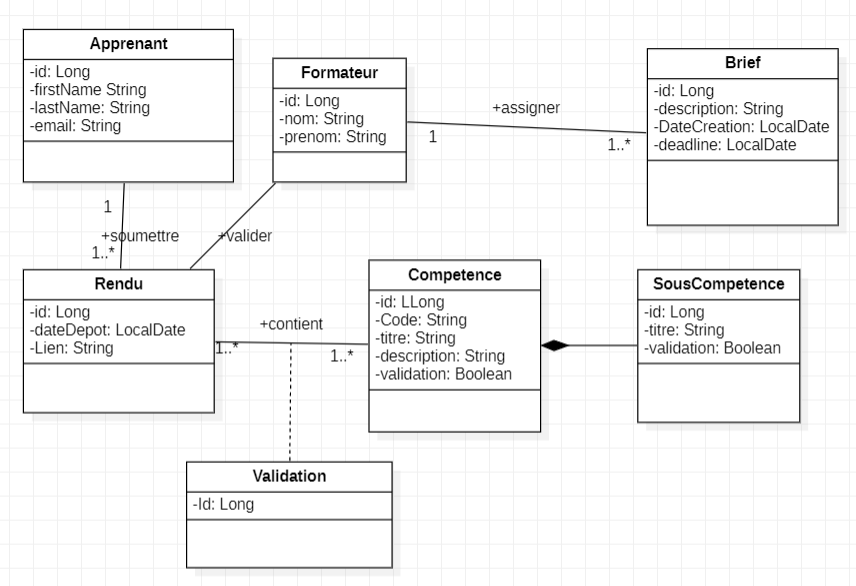
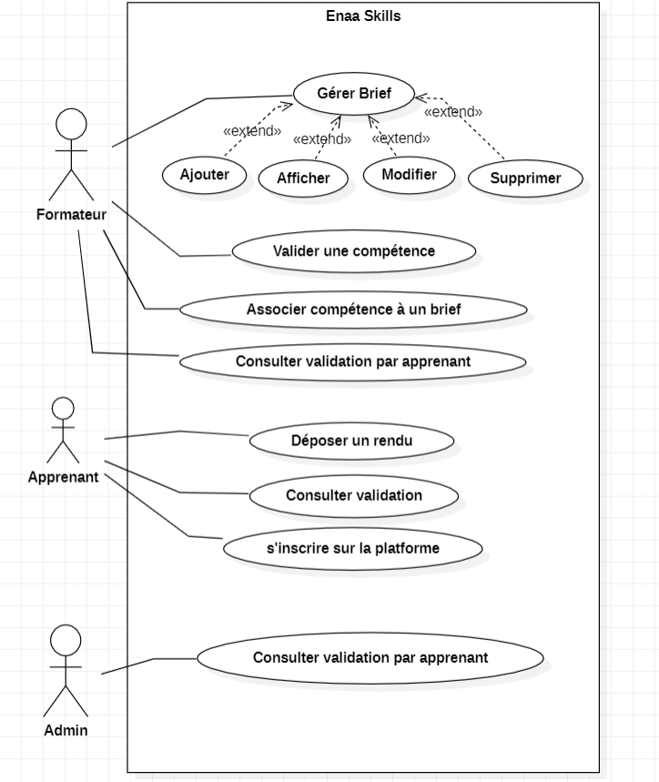
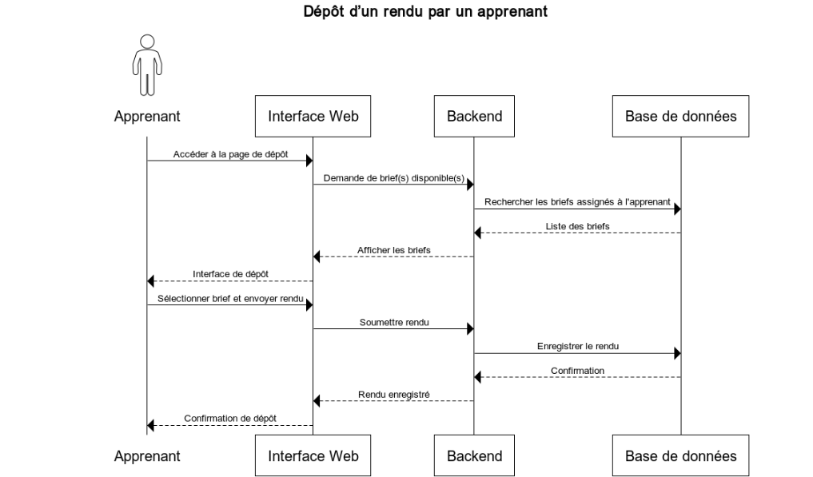

# 🎓 ENAA Skills – Suivi des Compétences des Apprenants

ENAA Skills est une plateforme web dédiée au suivi de l’acquisition des compétences des apprenants à travers des briefs pédagogiques, évalués par les formateurs. L'application adopte une architecture microservices, offrant une modularité et une évolutivité optimale.

───────────────────────────────

📌 Table des matières

- ✨ Fonctionnalités principales
- 👥 Rôles & Parcours utilisateurs
- ⚙️ Architecture Microservices
- 🛠️ Technologies utilisées
- 🚀 Installation & lancement
- ✅ Tests
- 📂 UML & Modélisation

───────────────────────────────

✨ Fonctionnalités principales

- 👨‍🎓 Gestion des apprenants, formateurs et administrateurs
- 📝 Création et gestion des briefs pédagogiques
- 🔗 Association des compétences et sous-compétences aux briefs
- 📤 Dépôt de rendus par les apprenants
- ✔️ Validation des compétences par les formateurs
- 📊 Suivi des validations et de la progression des apprenants
- 🖥️ Interface administrateur avec statistiques globales

───────────────────────────────

👥 Rôles & Parcours Utilisateurs

👤 Apprenant
- 🆕 S’inscrire sur la plateforme
- 📤 Déposer un rendu pour un brief
- 📖 Consulter ses rendus et compétences validées

🧑‍🏫 Formateur
- ✍️ Créer un brief pédagogique
- 🔗 Associer des compétences à un brief
- ✔️ Valider les compétences des apprenants
- 📚 Consulter les compétences validées par apprenant

🛡️ Administrateur
- 👁️ Visualiser toutes les validations
- 📈 Suivre l’état global des compétences par apprenant
- 🛠️ Gérer les utilisateurs et briefs si nécessaire

───────────────────────────────

⚙️ Architecture Microservices

Le projet est découpé en plusieurs services indépendants :
- 📄 Brief-Service : Gestion des briefs et des compétences associées
- 👨‍🎓 Apprenant-Service : Gestion des utilisateurs apprenants et des rendus
- ✔️ Validation-Service : Suivi et validation des compétences

La communication entre services se fait via REST (RestTemplate ou Feign Client).

───────────────────────────────

🛠️ Technologies Utilisées

Couche          : Technologies  
Backend         : Spring Boot, Spring Data JPA  
Communication   : RestTemplate ou Feign Client  
Base de données : MySQL / PostgreSQL  
Conteneurisation: Docker, Docker Compose  
Tests           : JUnit  
Documentation   : Swagger  
Visualisation   : Chart.js (optionnel pour statistiques)

───────────────────────────────

🚀 Installation & lancement

Prérequis :
- ☕ Java 17+
- 🐳 Docker & Docker Compose
- 📦 Maven

───────────────────────────────

✅ Tests

Chaque microservice contient des tests unitaires avec JUnit :

───────────────────────────────

Développé dans le cadre d’un projet ENAA – Suivi des compétences.  
Pour toute contribution ou suggestion, n’hésitez pas à ouvrir une issue ou une pull request.

───────────────────────────────

📂 UML & Modélisation

**_Diagramme de Class_**

**_Diagramme de Cas d'utilisation_**

**_Diagramme de Séquence_**
